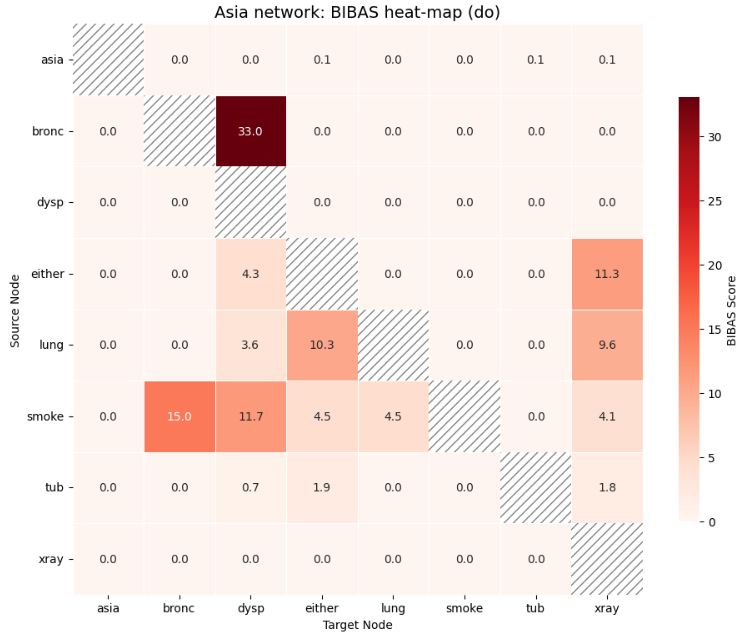

# BIBAS: Bayesian-network Impact factor Based on Analysis of Shifts
Quantify node-to-node impact, rank influential sources, and visualise
Bayesian Networks with publication-quality layouts.

<p align="center">
  <!--  -->
</p>

---

## What’s inside (v0.2.0)

| Area                      | Key objects (import paths)                                           |
|---------------------------|-----------------------------------------------------------------------|
| **Impact metrics**        | `bibas.inference_utils.compute_bibas_pairwise`  •  `rank_sources_for_target` |
| **Heat- & bar-plots**     | `bibas.visual_analysis.plot_binary_bibas_heatmap`  •  `plot_ranked_sources_for_target` |
| **Full BN visualisation** | `bibas.visual_analysis.plot_bn`  – 5 modes: *none · blanket · impacts · edges · edges_and_impacts* |
| **Custom graph layouts**  | `bibas.extra_layouts`  (hierarchy, reversed hierarchy, jittered, radial) |
| **Binary & intervention** | All metrics work with `operation="observe"` **or** `operation="do"` |

All public symbols are re-exported in `bibas.__init__` — tip-autocomplete with `bibas.<tab>`.

---

## 📦 Installation
```bash
pip install bibas     # Python ≥ 3.7
```

---

## 🚀 Quick Start
```python
import networkx as nx
from pgmpy.utils import get_example_model
from bibas import (
    compute_bibas_pairwise,
    plot_binary_bibas_heatmap,
    plot_ranked_sources_for_target,
    plot_bn,
)

# 1 Load demo network
model  = get_example_model("asia")
target = "dysp"        # binary node

# 2 Pairwise impact heat‑map (observe)
plot_binary_bibas_heatmap(model, operation="observe")

# 3 Top sources influencing a target (intervention)
plot_ranked_sources_for_target(model, target, operation="do")

# 4 Structure plot with edge & node impacts
plot_bn(model,
        layout=nx.spring_layout,
        type="edges_and_impacts",
        target=target,
        operation="observe")
```

---

## 📐 Layout Gallery

| Layout helper                                   | Visual style (depth) | Typical use‑case                        |
|-------------------------------------------------|----------------------|-----------------------------------------|
| `hierarchy_layout`                              | Top‑down layers      | Highlight generational flow             |
| `reversed_hierarchy_layout`                     | Bottom‑up layers     | Trace effects backwards                 |
| `hierarchy_layout_jittered`                     | Top‑down + jitter    | Reduce edge crowding in wide layers     |
| `radial_layout`                                 | Concentric circles   | Show symmetry / centrality              |

```python
from bibas.extra_layouts import hierarchy_layout_jittered
plot_bn(model, layout=hierarchy_layout_jittered, layout_kwargs={"seed": 4, "jitter_strength": 0.4}, type="blanket", target="dysp")
```

---
## 📝 Functionalities (for examples see Example Notebook ahead)

| Function | Signature | Purpose |
|----------|-----------|---------|
| `compute_bibas_pairwise` | `compute_bibas_pairwise(model, operation='observe')` | Return a full node × node impact matrix (observe / do). |
| `rank_sources_for_target` | `rank_sources_for_target(model, target, operation='observe')` | Rank all source nodes by their influence on a binary *target* state. |
| `plot_binary_bibas_heatmap` | `plot_binary_bibas_heatmap(model, operation='observe', ax=None, **heatmap_kwargs)` | Draw an annotated heat-map of positive-state impacts. |
| `plot_ranked_sources_for_target` | `plot_ranked_sources_for_target(model, target, operation='observe', top_n=10, ax=None, **bar_kwargs)` | Horizontal bar-plot of the top–N influential sources for a target. |
| `plot_bn` | `plot_bn(model, layout='spring', type='blanket', target=None, operation='observe', ax=None, **layout_kwargs)` | Visualise the BN with optional blankets, impact colouring, or edge weights. |
| `hierarchy_layout` | `hierarchy_layout(G)` | Top-down layers based on depth (ideal for DAGs). |
| `reversed_hierarchy_layout` | `reversed_hierarchy_layout(G)` | Bottom-up view: deepest nodes appear at the top. |
| `hierarchy_layout_jittered` | `hierarchy_layout_jittered(G, jitter_strength=0.4, seed=None)` | Hierarchical layout with horizontal jitter to reduce edge overlap. |
| `radial_layout` | `radial_layout(G)` | Concentric rings by depth; emphasises symmetry and centrality. |

---

## Example Notebook  
See **`examples/asia_demo.ipynb`** for a fully reproducible walkthrough of every figure in this README.

