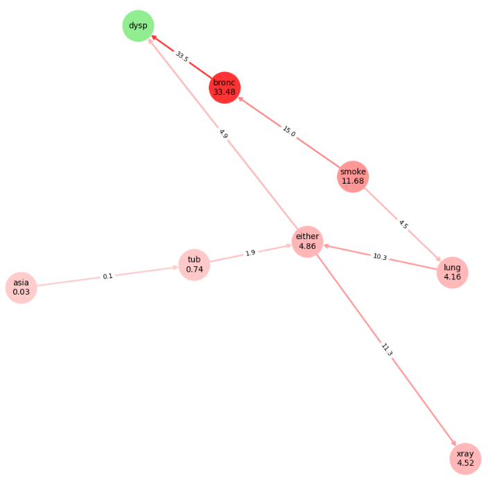

# BIBAS: Bayesian-network Impact factor Based on Analysis of Shifts
Quantify node-to-node impact, rank influential sources, and visualise
Bayesian Networks with publication-quality layouts.

<p align="center">
  
</p>

---

## What’s inside (v0.2.0)

| Area                      | Key objects (import paths)                                           |
|---------------------------|-----------------------------------------------------------------------|
| **Impact metrics**        | `bibas.inference_utils.compute_bibas_pairwise`  •  `rank_sources_for_target` |
| **Heatmaps & bar-plots**  | `bibas.visual_analysis.plot_binary_bibas_heatmap`  •  `plot_ranked_sources_for_target` |
| **Full BN visualisation** | `bibas.visual_analysis.plot_bn`  – 5 modes: *none · blanket · impacts · edges · edges_and_impacts* |
| **Custom graph layouts**  | `bibas.extra_layouts`  (hierarchy, reversed hierarchy, jittered, radial) |
| **observation & intervention** | All metrics work with `operation="observe"` **or** `operation="do"` |

---

## 📦 Installation
```bash
pip install bibas     # Python ≥ 3.7
```

---

## 🚀 Quick Start
```python
import networkx as nx
from pgmpy.utils import get_example_model
from bibas import (
    compute_bibas_pairwise,
    plot_binary_bibas_heatmap,
    plot_ranked_sources_for_target,
    plot_bn,
)

# 1 Load demo network
model  = get_example_model("asia")
target = "dysp"        # binary node

# 2 Pairwise impact heat‑map (observe)
plot_binary_bibas_heatmap(model, operation="observe")

# 3 Top sources influencing a target (intervention)
plot_ranked_sources_for_target(model, target, operation="do")

# 4 Structure plot with edge & node impacts
plot_bn(model,
        layout=nx.spring_layout,
        type="edges_and_impacts",
        target=target,
        operation="observe")
```

<p align="center">
  
</p>

---

## 📐 Layout Gallery

| Layout helper                                   | Visual style (depth) | Typical use‑case                        |
|-------------------------------------------------|----------------------|-----------------------------------------|
| `hierarchy_layout`                              | Top‑down layers      | Highlight generational flow             |
| `reversed_hierarchy_layout`                     | Bottom‑up layers     | Trace effects backwards                 |
| `hierarchy_layout_jittered`                     | Top‑down + jitter    | Reduce edge crowding in wide layers     |
| `radial_layout`                                 | Concentric circles   | Show symmetry / centrality              |


```python
from bibas.extra_layouts import hierarchy_layout_jittered
plot_bn(model, layout=hierarchy_layout_jittered, layout_kwargs={"seed": 4, "jitter_strength": 0.4}, type="blanket", target="dysp")
```

---
## 📝 Functionalities (for examples see Example Notebook ahead)

| Function | Signature | Purpose |
|----------|-----------|---------|
| `compute_bibas_pairwise` | `compute_bibas_pairwise(model, operation='observe')` | Return a full node × node impact matrix (observe / do). |
| `rank_sources_for_target` | `rank_sources_for_target(model, target, operation='observe')` | Rank all source nodes by their influence on a binary *target* state. |
| `plot_binary_bibas_heatmap` | `plot_binary_bibas_heatmap(model, operation='observe', ax=None, **heatmap_kwargs)` | Draw an annotated heat-map of positive-state impacts. |
| `plot_ranked_sources_for_target` | `plot_ranked_sources_for_target(model, target, operation='observe', top_n=10, ax=None, **bar_kwargs)` | Horizontal bar-plot of the top–N influential sources for a target. |
| `plot_bn` | `plot_bn(model, layout='spring', type='blanket', target=None, operation='observe', ax=None, **layout_kwargs)` | Visualise the BN with optional blankets, impact colouring, or edge weights. |
| `hierarchy_layout` | `hierarchy_layout(G)` | Top-down layers based on depth (ideal for DAGs). |
| `reversed_hierarchy_layout` | `reversed_hierarchy_layout(G)` | Bottom-up view: deepest nodes appear at the top. |
| `hierarchy_layout_jittered` | `hierarchy_layout_jittered(G, jitter_strength=0.4, seed=None)` | Hierarchical layout with horizontal jitter to reduce edge overlap. |
| `radial_layout` | `radial_layout(G)` | Concentric rings by depth; emphasises symmetry and centrality. |

---

## Example Notebook  
See **`examples/asia_demo.ipynb`** for a fully reproducible walkthrough of every functionality in this README.


---
***
---


## Function references

### `bibas.inference_utils`

#### `compute_bibas_pairwise(model, source, target, target_positive_state=1, operation="observe")`

| argument | type | default | description |
|-----------|------|---------|-------------|
| `model` | `pgmpy.models.DiscreteBayesianNetwork` | required | Fully specified discrete BN that already passed `model.check_model()` |
| `source` | `str` | required | Source node name |
| `target` | `str` | required | Target node name (must be binary) |
| `target_positive_state` | `int` or `str` | `1` | Positive state of the binary target, by index or state name |
| `operation` | `"observe"` or `"do"` | `"observe"` | Evidence based update (`observe`) or intervention (`do`) |

Returns a float from 0 to 100 (higher = stronger impact) or `None` if undefined.  
Raises `ValueError` for a non-binary target or invalid `operation`.

    score = compute_bibas_pairwise(model, "X", "Y", operation="do")

---

#### `rank_sources_for_target(model, target, target_positive_state=1, operation="observe")`

Ranks every node except the target by its BIBAS score.

| argument | type | default | description |
|-----------|------|---------|-------------|
| `model` | `DiscreteBayesianNetwork` | required | The BN |
| `target` | `str` | required | Binary target node |
| `target_positive_state` | `int` | `1` | Positive state index |
| `operation` | `"observe"` or `"do"` | `"observe"` | Impact definition |

Returns a `pandas.DataFrame` with columns `source` and `bibas_score`, already sorted.

---

### `bibas.visual_analysis`

#### `plot_binary_bibas_heatmap(model, operation="observe", filename=None, title=None)`

| argument | type | default | description |
|-----------|------|---------|-------------|
| `model` | `DiscreteBayesianNetwork` | required | Every node must be binary |
| `operation` | `"observe"` or `"do"` | `"observe"` | Impact definition |
| `filename` | `str` or `None` | `None` | If supplied, save the plot instead of showing it |
| `title` | `str` or `None` | `None` | Optional title |

Displays or saves a heat-map of pairwise impacts. Returns nothing.

---

#### `plot_ranked_sources_for_target(model, target, target_positive_state=1, operation="observe", filename=None, title=None)`

Horizontal bar chart ranking sources for a single binary target.

| argument | type | default | description |
|-----------|------|---------|-------------|
| `model` | `DiscreteBayesianNetwork` | required | The BN |
| `target` | `str` | required | Binary target node |
| `target_positive_state` | `int` | `1` | Positive state index |
| `operation` | `"observe"` or `"do"` | `"observe"` | Impact definition |
| `filename` | `str` or `None` | `None` | Optional save path |
| `title` | `str` or `None` | `None` | Optional title |

Shows or saves the plot. No return value.

---

#### `plot_bn(model, layout=nx.spring_layout, type="none", target=None, operation="observe", filename=None, title=None, layout_kwargs=None)`

Visualises the BN with optional BIBAS-based colouring.

| argument | type | default | description |
|-----------|------|---------|-------------|
| `model` | `DiscreteBayesianNetwork` | required | Network to draw |
| `layout` | callable | `nx.spring_layout` | Any NetworkX layout or one from `bibas.extra_layouts` |
| `type` | `"none"` / `"blanket"` / `"impacts"` / `"edges"` / `"edges_and_impacts"` | `"none"` | Visual style |
| `target` | `str` or `None` | `None` | Required for blanket or impact modes |
| `operation` | `"observe"` or `"do"` | `"observe"` | Impact definition for impact modes |
| `filename` | `str` or `None` | `None` | Optional save path |
| `title` | `str` or `None` | `None` | Optional title |
| `layout_kwargs` | `dict` or `None` | `None` | Extra keyword arguments passed to the layout |

Raises `ValueError` for unknown `type`, missing `target` where needed, or edge modes with non-binary nodes. Shows or saves the figure.

    from bibas.extra_layouts import hierarchy_layout_jittered

    plot_bn(
        model,
        layout=hierarchy_layout_jittered,
        layout_kwargs={"seed": 1, "jitter_strength": 0.3},
        type="blanket",
        target="Y"
    )

---

### `bibas.extra_layouts`

All helpers return a dictionary mapping each node to `(x, y)` coordinates that NetworkX accepts.

#### `hierarchy_layout(G)`

| argument | type | description |
|-----------|------|-------------|
| `G` | `networkx.DiGraph` | Directed graph to layout |

Top-down hierarchy based on depth.

---

#### `reversed_hierarchy_layout(G)`

Same as `hierarchy_layout` but flipped vertically so roots appear at the bottom.

---

#### `hierarchy_layout_jittered(G, jitter_strength=0.4, seed=None)`

| argument | type | default | description |
|-----------|------|---------|-------------|
| `G` | `networkx.DiGraph` | required | Directed graph |
| `jitter_strength` | `float` | `0.4` | Maximum horizontal shift per layer |
| `seed` | `int` or `None` | `None` | Random seed for reproducible jitter |

Hierarchy layout with horizontal noise to reduce overlap.

---

#### `radial_layout(G)`

| argument | type | description |
|-----------|------|-------------|
| `G` | `networkx.DiGraph` | Directed graph |

Root nodes in the centre with children on concentric circles.

---
